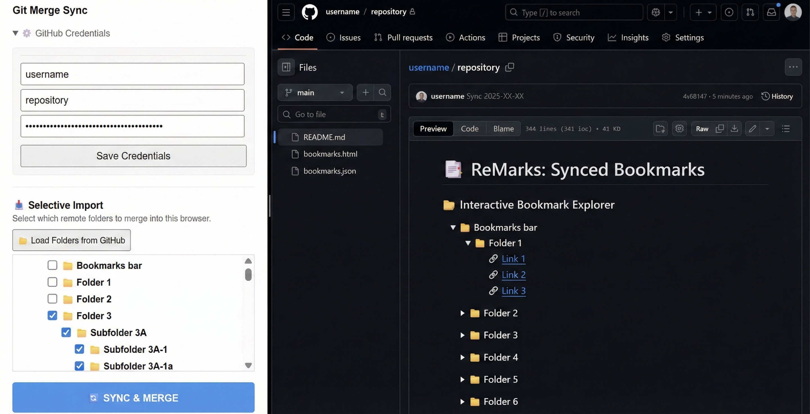

# ReMarks: Hybrid Bookmark Sync

**ReMarks** is a Chrome extension designed to maintain a list of bookmarks synchronized across different profiles (e.g., Personal vs. Work) using your own private GitHub repository as the secure backend.

It doesn't replace native Chrome Sync; it complements it.
<p>


## The Concept: Hybrid Synchronization

Standard Chrome Sync is great for keeping your laptop and desktop in sync *if they use the same Google account*. But it cannot sync between your "Work Profile" and your "Personal Profile."

ReMarks solves this with a hybrid approach:

### The Architecture Diagram

```mermaid
%%{init: {'theme': 'base', 'themeVariables': { 'primaryColor': '#fff', 'edgeLabelBackground':'#fff', 'tertiaryColor': '#f4f4f4'}}}%%
graph TD
    %% --- SCENARIO A: Personal Ecosystem ---
    subgraph "Scenario A: Personal Profile (Native Sync)"
        style Cloud fill:#4285F4,stroke:#4285F4,color:white,stroke-dasharray: 5 5
        
        DA["💻 Laptop 1<br>(Personal)"]:::chrome <-->|Auto| Cloud("☁️ Google Cloud"):::cloud
        Cloud <-->|Auto| DB["🖥️ Desktop PC<br>(Personal)"]:::chrome
    end

    %% --- SCENARIO B: The Bridge ---
    %% Connecting the devices to the extension
    DB -.->|Sync & Merge| ExtPersonal
    DC -.->|Sync & Merge| ExtWork

    subgraph "Scenario B: Work Profile (Git Bridge)"
        style GH fill:#24292e,stroke:#333,color:white
        
        DC["💼 Work Laptop<br>(Work Profile)"]:::chrome
        
        subgraph "ReMarks Extension Layer"
            ExtPersonal["🧩 ReMarks<br>(Personal)"]:::ext
            ExtWork["🧩 ReMarks<br>(Work)"]:::ext
        end

        GH[("🐙 GitHub Repo<br>(Private)")]:::git
        
        ExtPersonal <-->|Bi-Directional| GH
        GH <-->|Bi-Directional| ExtWork
    end

    %% Styling Classes
    classDef chrome fill:#fff,stroke:#4285F4,stroke-width:2px;
    classDef ext fill:#fff3e0,stroke:#FF9800,stroke-width:2px,stroke-dasharray: 5 5;
    classDef git fill:#fff,stroke:#24292e,stroke-width:3px;
    classDef cloud fill:#4285F4,color:white;
````

1.  **Same Profile:** You rely on standard, automatic Chrome Sync to keep devices logged into the *same* profile updated.
2.  **Cross-Profile:** You use the **ReMarks "Sync & Merge" button** to sync changes between a profile and GitHub.
      * The extension uses a "Smart Merge" algorithm. It downloads the master list from Git, adds any new local bookmarks to it, and then pushes the complete, unified list back to GitHub.

## Features

  * **📥 Selective Import (New):** Choose exactly which remote folders you want to merge into your current browser (e.g., import "Tech Docs" but skip "Personal Recipes").
  * **🔗 Profile Bridging:** Keep work and personal bookmarks in sync without linking Google accounts.
  * **🧠 Smart Merge Logic:** The extension syncs based on URLs and folder paths. It won't delete your bookmarks; it performs a union merge to ensure everything is saved.
  * **🔒 You Own Your Data:** Bookmarks are stored in your own private GitHub repository.
  * **📂 Interactive Tree Generation:** The extension automatically generates a `README.md` in your repo with a clickable, collapsible HTML tree of all your links.
  * **📝 UTF-8 & Emoji Support:** Full support for folder names with special characters and emojis.
  * **🎒 Portable Disaster Recovery:** Every sync also pushes a standard `bookmarks.html` (Netscape format) file.

## Prerequisites

1.  **A GitHub Account.**
2.  **A Private Repository:** Create an empty repository on GitHub (e.g., `my-bookmarks-hub`).
3.  **A Personal Access Token (PAT):**
      * Go to GitHub Settings -\> Developer Settings -\> Personal access tokens -\> Tokens (classic).
      * Generate a new token.
      * **Important:** Only select the **`repo`** scope (Full control of private repositories).
      * Copy the generated token immediately.

## Installation (Developer Mode)

Since this is a custom extension, you load it unpackaged:

1.  Clone or download this repository to a folder on your computer.
2.  Open Chrome and navigate to `chrome://extensions`.
3.  Toggle **Developer mode** in the top right corner.
4.  Click **Load unpacked**.
5.  Select the folder containing the extension files (`manifest.json`, `popup.html`, etc.).

## Configuration & Usage

1.  Click the extension icon in your browser toolbar.
2.  **Setup Credentials:** Enter your GitHub Username, Repository Name, and Personal Access Token, then click **Save Credentials**.
3.  **Sync:** Click **🔄 SYNC & MERGE** to merge remote bookmarks into your browser and push local changes back to GitHub.

-----

## 📂 Browse & Restore

Even without the extension, your bookmarks are always accessible.

**1. Browse Online (Interactive)**
This README automatically updates with a clickable, collapsible tree (see the "Interactive Bookmark Explorer" section generated by the extension). You can find any link instantly right here on GitHub.

**2. Import to Browser (Manual)**
If you are on a public computer or a device where you cannot install the extension:

1.  Download the `bookmarks.html` file from the file list.
2.  Open your browser's Bookmark Manager.
3.  Select **Import Bookmarks** and choose the downloaded file to restore your full folder structure.

